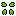

# bookmarks
[AI](#ai) |
[Apple](#apple) |
[Cloud](#cloud) |
[Dev](#dev) |
[Gamedev](#gamedev) |
[Gaming](#gaming) |
[Google](#google) |
[Linux](#linux) |
[Live Streaming](#live-streaming) |
[Live Streaming Tools](#live-streaming-tools) |
[Mail](#mail) |
[Microsoft](#microsoft) |
[ROMhacking](#romhacking) |
[Social Networking](#social-networking)
[Speedrunning](#speedrunning) |
[Streaming](#streaming) |
[Tools](#tools) |
[uncategorized!](#uncategorized)

## AI

[Bard](https://bard.google.com/chat/)

[ChatGPT](https://chat.openai.com/)

[DALL-E](https://labs.openai.com/)

[xAI Grok](https://grok.x.ai/)

## Apple

[Apple ID](https://appleid.apple.com/)

[iCloud](https://icloud.com/)

## Cloud

[Dropbox](https://dropbox.com/)

[Google Drive](https://drive.google.com/)

[iCloud](https://icloud.com/)

[MEGA](https://mega.nz/)

[OneDrive](https://onedrive.com/)

## Dev

[GitHub](https://github.com/)

## Gamedev

## Gaming

[Citra](https://citra-emu.org/)
([Account](https://profile.citra-emu.org/),
[AppImage](https://github.com/citra-emu/citra-nightly/releases/),
[Flatpak](https://flathub.org/apps/org.citra_emu.citra),
[Forum](https://community.citra-emu.org/),
[Package](https://software.opensuse.org/package/citra),
[Snap](https://snapcraft.io/citra-emu))

[Nestopia UE](http://0ldsk00l.ca/nestopia/)
([Flatpak](https://flathub.org/apps/ca._0ldsk00l.Nestopia),
[Package](https://software.opensuse.org/package/nestopia))

[PokeForce](https://pokeforce.org/)
([AppImage](https://forum.pokeforce.org/#downloads.45),
[Forum](https://forum.pokeforce.org/))

[PokeMMO](https://pokemmo.eu/)
([Forum](https://forums.pokemmo.com/),
[Snap](https://snapcraft.io/pokemmo))

[Ryujinx](https://ryujinx.org/)
([Flatpak](https://flathub.org/apps/org.ryujinx.Ryujinx))

[Snes9x](https://snes9x.com/)
([Flatpak](https://flathub.org/apps/com.snes9x.Snes9x),
[Package](https://software.opensuse.org/package/snes9x))

[yuzu](https://yuzu-emu.org/)
([Account](https://profile.yuzu-emu.org/),
[AppImage](https://yuzu-emu.org/downloads/#linux),
[Flatpak](https://flathub.org/apps/org.yuzu_emu.yuzu),
[Forum](https://community.citra-emu.org/),
[Package](https://software.opensuse.org/package/yuzu),
[Snap](https://snapcraft.io/yuzu))

[yuzu EA](https://pineappleea.github.io/)
([AppImage](https://github.com/pineappleEA/pineapple-src/releases/),
[Package](https://software.opensuse.org/package/yuzu-EarlyAccess))

## Google

[Bard](https://bard.google.com/chat/)

[Gmail](https://mail.google.com/)

[Google Account](https://myaccount.google.com/)

[Google Calendar](https://calendar.google.com/)

[Google Docs](https://docs.google.com/document/)

[Google Drive](https://drive.google.com/)

[Google Keep](https://keep.google.com/)

[Google Sheets](https://docs.google.com/spreadsheets/)

[Google Translate](https://translate.google.com/)

## Linux

[Docker Hub](https://hub.docker.com/)

[Flathub](https://flathub.org/)

[Flatpak](https://flatpak.org/)

[Open Build Service](https://build.opensuse.org/)

[Snapcraft](https://snapcraft.io/)

[streamdeck-linux-gui](https://pypi.org/project/streamdeck-linux-gui/)

[openSUSE](https://opensuse.org/)
  -  [Package](https://software.opensuse.org/)
  -  [Paste](https://paste.opensuse.org/)
  -  [Status](https://status.opensuse.org/)

## Live Streaming

[Kick](https://kick.com/)

[Trovo](https://trovo.live/)

[Twitch](https://twitch.tv/)

[YouTube](https://youtube.com/)

## Live Streaming Tools

[FrankerFaceZ](https://frankerfacez.com/)

[LiveSplit One](https://one.livesplit.org/)

[OBS Studio](https://obsproject.com/)

- Applications
  -  [OBS-CLI (WebSocket 5.X)](https://pypi.org/project/obs-cli/)
  -  [OBS-CLI (WebSocket 4.X)](https://github.com/muesli/obs-cli/)
- Scripts
- 
  -  [Advanced Timer](https://github.com/cg2121/obs-advanced-timer)
  -  [Random Text](https://github.com/revenkroz/obs-random-text/)
  - 
- Plugins
  -  [DroidCam](https://github.com/dev47apps/droidcam-obs-plugin/)
  -  [Composite Blur](https://github.com/FiniteSingularity/obs-composite-blur/)
  -  [LiveSplit One](https://github.com/LiveSplit/obs-livesplit-one/)
  -  [MultiRTMP](https://github.com/sorayuki/obs-multi-rtmp/)
  -  [Source Record](https://github.com/exeldro/obs-source-record/)

[OBS Studio Forum](https://obsproject.com/forum/)

[streamdeck-linux-gui](https://pypi.org/project/streamdeck-linux-gui/)

[Streamlabs Dashboard](https://streamlabs.com/dashboard/)

[X Media Studio](https://studio.x.com/)

## Mail

[Gmail](https://mail.google.com/)

[iCloud](https://icloud.com/)

[Outlook](https://outlook.live.com/)

[Proton](https://account.proton.me/)

[Temp-Mail](https://temp-mail.org/)

## Microsoft

[Microsoft Account](https://account.microsoft.com/)

[OneDrive](https://onedrive.com/)

[Outlook](https://outlook.live.com/)

## ROMhacking

## Social Networking

[4chan](https://4chan.org/)

[Facebook](https://facebook.com/)

[Instagram](https://instagram.com/)

[Fosstodon](https://fosstodon.org/)

[Reddit](https://reddit.com/)

[TikTok](https://tiktok.com/)

[X (Twitter)](https://twitter.com/)

[ニコニコ (nicovideo)](https://nicovideo.jp/)

## Speedrunning

[LiveSplit One](https://one.livesplit.org/)

[SDA Forum](https://forum.speeddemosarchive.com/)

[Speedrun.com](https://speedrun.com/)

[SpeedRunsLive](https://speedrunslive.com/)

## Streaming

[discovery+](https://discoveryplus.com/)

[Disney+](https://disneyplus.com/)

[MTV Katsomo](https://mtv.fi/)

[Netflix](https://netflix.com/)

[Ruutu](https://www.ruutu.fi/)

[Yle Areena](https://areena.yle.fi/)

## Tools

[Alphabetizer](https://alphabetizer.flap.tv/)

[Emojipedia](https://emojipedia.org/)

[Fast.com](https://fast.com/)

[Photopea](https://www.photopea.com/)

[Pixel It](https://giventofly.github.io/pixelit/#tryit/)

[Vectorpea](https://www.vectorpea.com/)

[16:9 Aspect Ratio Calculator](https://calculateaspectratio.com/16-9-calculator/)

[4:3 Aspect Ratio Calculator](https://calculateaspectratio.com/4-3-calculator/)

## uncategorized!

